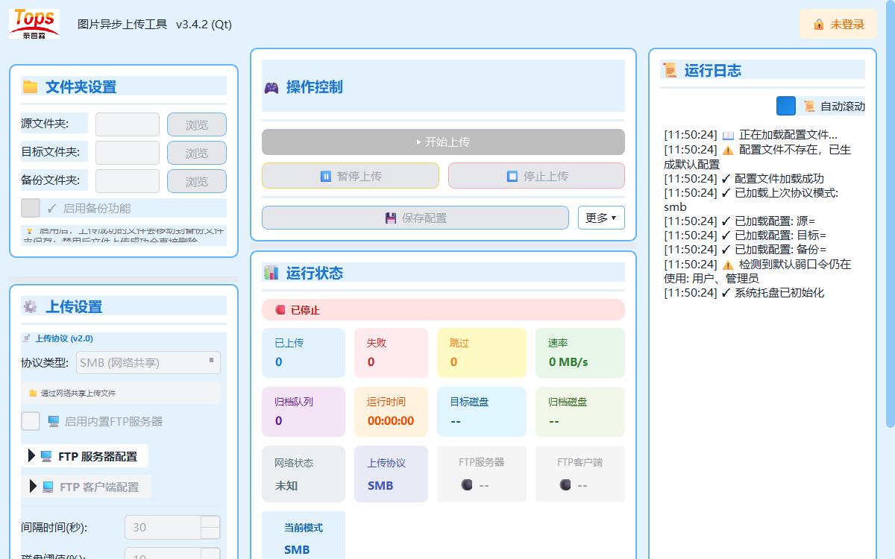

# MVC 重构最终验收报告

验收日期：2026-08-07

## 总结

阶段 0 至阶段 8 已全部实施。项目当前是 MVC 主结构，Service/Repository/Worker/Protocol 位于 Model 侧，`src/main.py` 是唯一生产组合根。静态边界、业务状态、真实本地 SMB、回环 FTP、Qt View、关闭顺序和配置兼容均有自动化证据。

## 最终验收矩阵

| 验收项 | 结果 | 证据 |
|---|---|---|
| UI 不导入 Worker、Protocol 或配置持久化实现 | 通过 | `test_architecture_boundaries.py`，UI 禁止依赖集合为空 |
| Model 不导入 `QtWidgets` | 通过 | Model 层静态导入检查 |
| Controller 只协调，不实现底层 IO | 通过 | Controller 具体依赖与 IO 导入/调用静态检查 |
| Model/Controller 可脱离真实主窗口测试 | 通过 | Model 单测、Controller Fake Service/View 测试 |
| 状态由明确 Model 管理 | 通过 | `AuthModel`、`UploadRuntimeState` 及配置/任务结果模型 |
| 后台任务通过事件通知 Controller | 通过 | Upload/Cleanup/FTP 事件回归测试 |
| View 只负责输入、展示和界面事件 | 通过 | UI 静态边界与独立 View 组件测试 |
| 配置文件向后兼容 | 通过 | 默认配置无损往返、未知字段保留、用户密码保留测试 |
| SMB、FTP 客户端、FTP 服务端和双写模式保持 | 通过 | 真实本地 SMB 上传/归档、回环 FTP 上传/下载/事件、模式校验测试 |
| 登录、权限、日志、托盘和自动清理保持 | 通过 | Auth、权限菜单、Runtime、清理策略、日志与 Windows 托盘回归 |
| 当前自动化测试全部通过 | 通过 | `78 passed, 5 subtests passed` |
| 新增 Controller、Model 和架构边界测试 | 通过 | `test_*_mvc.py` 与 `test_architecture_boundaries.py` |
| 项目说明与最终目录一致 | 通过 | 根 README、`docs/README.md`、`MVC_ARCHITECTURE.md` |

## 组合根审计

`src/main.py` 显式创建 5 个 Repository、5 个 Service、2 个长期状态 Model、7 个 Controller 和 1 个 `MainWindow`。生产目录中不存在第二处具体 MVC 对象图装配。具体组件导入发生在依赖检查之后。

## 回归证据

```text
python -m compileall -q src tests
pytest -q --basetemp=<工作区内唯一目录> -p no:cacheprovider

78 passed, 5 subtests passed in 8.35s
```

Windows 桌面视觉回归截图：



人工查看结论：中文字体、窗口标题、三栏布局、表单、操作区、状态卡、运行日志和纵向滚动均正常，无明显重叠或截断。托盘图标在关闭前可见，退出后成功隐藏。

## 已知环境风险

- 发布前仍应在目标工位验证真实共享盘权限、网络抖动、防火墙、FTP/TLS 证书及现场路径；自动化环境使用本地目录和回环网络。
- 上传线程保留超时后的强制终止兜底，异常慢速存储环境应通过日志确认是否触发。
