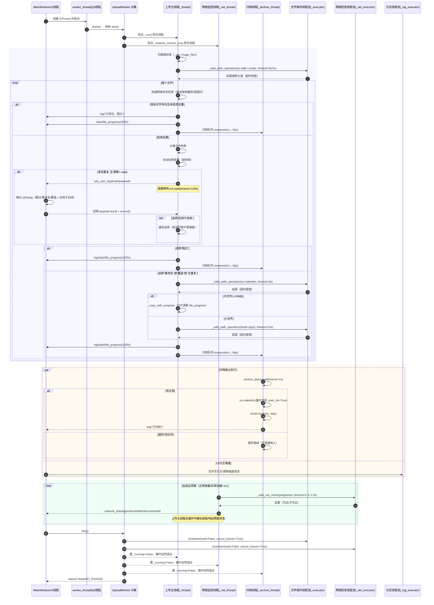

# 线程与调用关系时序图（v1.9）

本文档展示应用在“启动 → 正常上传/重复询问/网络监控 → 停止”过程中的跨线程调用与阻塞关系。图中仅标注关键路径与超时点。

## 时序图

## 说明与原则

- UI 线程仅做界面与信号处理；所有耗时 I/O（日志、磁盘查询）交给 `LE` 异步执行。
- 上传主线程与网络监控线程的所有可能“卡住”的系统调用，都经由线程池封装并设置明确超时（2–10s），确保最坏只阻塞各自线程，不影响 UI。
- 重复文件“询问模式”是唯一跨线程的“设计性等待”：上传主线程等待 UI 的选择，超时 120s 后默认按“跳过”，并支持“应用于后续”缓存选择以消除后续弹窗。
- 归档在独立线程进行，不阻塞上传；队列 get 使用 1s 超时避免死等。
- 停止流程使用线程池的非阻塞 shutdown（cancel_futures），各线程按 `_running=False` 自行收尾并发信号给 UI。

## 关联代码入口

- 启动：`MainWindow._on_start` → `worker_thread` → `UploadWorker.start`
- 上传主循环：`UploadWorker._run`
- 网络监控：`UploadWorker._network_monitor_loop`
- 安全操作封装：`UploadWorker._safe_path_operation`、`UploadWorker._safe_net_check`
- 归档：`UploadWorker._archive_worker`
- 停止：`UploadWorker.stop`、`MainWindow._on_stop`
